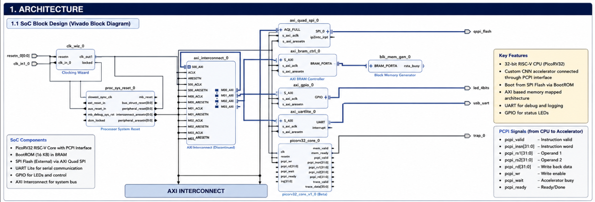

<div align="center">

# CNN-RISC-V Accelerator

### Hardware/Software Co-Design of a Custom CNN Accelerator for PicoRV32 Using the Pico Co-Processor Interface (PCPI)

[](LICENSE)


</div>

---

<p align="center">

</p>

<p align="center">
<b>Complete CNN-RISC-V Accelerator System-on-Chip implemented using a modified PicoRV32 processor and a custom CNN coprocessor connected through the Pico Co-Processor Interface (PCPI).</b>
</p>

---

# Overview

This repository contains the complete hardware and software implementation of a **CNN hardware accelerator** developed as part of the **Summer Internship 2026**.

The project demonstrates a complete **hardware/software co-design** in which a modified **PicoRV32 RISC-V processor** communicates with a custom CNN accelerator through the **Pico Co-Processor Interface (PCPI)**.

Instead of implementing the complete inference pipeline in hardware, the architecture partitions CNN execution between dedicated RTL hardware and firmware.

The RTL accelerator performs the computationally intensive operations required for convolutional neural networks, while PicoRV32 firmware performs programmable post-processing such as Max Pooling, intermediate scaling, quantization, and output formatting.

This partition provides significantly greater flexibility than implementing the entire inference pipeline in RTL while still accelerating the most computationally demanding portions of CNN inference.

---

# Project Highlights

✔ Modified PicoRV32 processor with PCPI support

✔ Two custom RISC-V instructions for accelerator control

✔ Dedicated RTL CNN accelerator

✔ Hardware implementation of convolution, MAC, and ReLU

✔ Firmware implementation of post-processing

✔ Complete BootROM and firmware execution

✔ RTL verification environment

✔ Complete System-on-Chip simulation

✔ Modular architecture for future CNN extensions

---

# Features

## Hardware

- Modified PicoRV32 Processor
- Custom CNN Accelerator
- Pico Co-Processor Interface (PCPI)
- AXI BRAM Controller
- Block RAM (BRAM)
- AXI Quad SPI
- UART Lite
- GPIO
- BootROM
- Vivado Block Design

---

## Firmware

- RISC-V Assembly
- C-based post-processing
- Custom instruction support
- CNN parameter configuration
- Max Pooling
- Intermediate Scaling
- Arithmetic Right Shift
- Quantization
- INT8 feature map generation

---

## Verification

- Standalone RTL Simulation
- Complete SoC Simulation
- UART Debug
- PCPI Verification
- Configuration Register Verification
- BootROM Verification
- Firmware Verification

---

# System Architecture

The complete embedded platform consists of the following major components.

```text
                     +-----------------------+
                     |     PicoRV32 CPU      |
                     +-----------+-----------+
                                 |
                           PCPI Interface
                                 |
                                 ▼
                  +------------------------------+
                  |     CNN RTL Accelerator       |
                  +------------------------------+
                  | Weight Loader                |
                  | Image Loader                 |
                  | Convolution Engine           |
                  | MAC Array                   |
                  | ReLU                        |
                  +--------------+--------------+
                                 |
                          INT16 Feature Map
                                 |
                                 ▼
                         Block RAM (BRAM)
                                 ▲
                                 |
                     PicoRV32 Firmware
                                 |
            Max Pool → Scale → Quantize → Clamp
                                 |
                                 ▼
                         INT8 Feature Map
```

The processor communicates with the accelerator using two custom RISC-V instructions implemented through the Pico Co-Processor Interface (PCPI). While the RTL accelerator performs convolutional computation, PicoRV32 firmware completes the remaining post-processing pipeline before storing the final quantized feature map.

---

# Hardware–Software Co-Design

The architecture intentionally divides CNN inference into two execution domains.

## RTL Hardware

Responsible for:

- Weight Loading
- Image Loading
- Convolution
- Multiply-Accumulate (MAC)
- ReLU Activation
- INT16 Feature Map Generation

---

## PicoRV32 Firmware

Responsible for:

- Reading Accelerator Output
- Max Pooling
- Intermediate Scaling
- Arithmetic Right Shift
- Quantization
- Clamping
- Writing Final INT8 Feature Maps

Separating these responsibilities enables the accelerator to remain focused on high-performance computation while maintaining software flexibility for numerical post-processing.

---

# Repository Structure

```text
cnn-riscv-accelerator/
│
├── cnn-software/              # CNN firmware and software
├── docs/                      # Complete project documentation
├── images/                    # Figures, architecture, simulations
│
├── rtl-simulation/            # Standalone RTL verification
├── soc-simulation/            # Complete SoC implementation
│
├── LICENSE
└── README.md
```
# CNN Accelerator

The CNN accelerator is implemented as a custom RTL coprocessor connected directly to the PicoRV32 processor through the **Pico Co-Processor Interface (PCPI)**.

Rather than replacing the processor, the accelerator extends the standard RISC-V execution model by introducing two application-specific instructions that configure and control CNN execution.

The accelerator is responsible for the computationally intensive stages of inference while allowing the processor to retain complete control over execution.

## Accelerator Features

- Hardware Convolution Engine
- Dedicated MAC Datapath
- ReLU Activation
- Configuration Registers
- PCPI-Based Communication
- Custom Instruction Support
- BRAM Interface
- Modular RTL Design

---

# Pico Co-Processor Interface (PCPI)

Communication between PicoRV32 and the CNN accelerator is implemented using the standard **Pico Co-Processor Interface (PCPI)**.

The PCPI provides a clean mechanism for integrating hardware accelerators without modifying the standard processor execution pipeline.

The accelerator receives custom instructions, captures configuration parameters, updates internal registers, and returns completion signals through the standard PCPI handshake interface.

## PCPI Request Signals

| Signal | Description |
|---------|-------------|
| `pcpi_valid` | Indicates a valid custom instruction |
| `pcpi_insn` | Complete instruction word |
| `pcpi_rs1` | Source Register 1 |
| `pcpi_rs2` | Source Register 2 |

---

## PCPI Response Signals

| Signal | Description |
|---------|-------------|
| `pcpi_ready` | Instruction completed |
| `pcpi_wr` | Register write-back enable |
| `pcpi_rd` | Returned debug data |
| `pcpi_wait` | Processor stall request |

The implemented interface follows the standard PicoRV32 PCPI specification and can be extended to support multi-cycle accelerator execution.

---

# Custom RISC-V Instructions

Two custom RISC-V instructions were developed to configure and control the CNN accelerator.

| Instruction | Purpose |
|-------------|---------|
| **CNN_LD_WT** | Configure weight-related parameters |
| **CNN_LD_IMG_EXE** | Configure image parameters and initiate CNN execution |

Using custom instructions eliminates the need for dedicated memory-mapped control registers while providing a compact and efficient software interface.

---

# CNN Processing Pipeline

The accelerator executes the computationally intensive stages of CNN inference.

```text
Input Image
      │
      ▼
Weight Loading
      │
      ▼
Image Loading
      │
      ▼
Convolution
      │
      ▼
Multiply-Accumulate (MAC)
      │
      ▼
ReLU Activation
      │
      ▼
INT16 Feature Map
      │
      ▼
Block RAM
```

The generated INT16 feature map is then processed by firmware to produce the final quantized output.

---

# Firmware Processing Pipeline

After accelerator execution completes, PicoRV32 firmware performs programmable post-processing.

```text
Read INT16 Feature Map
        │
        ▼
Max Pooling
        │
        ▼
Intermediate Scaling
        │
        ▼
INT16 × UINT16 (Q16)
        │
        ▼
INT32
        │
        ▼
Arithmetic Right Shift
        │
        ▼
Quantization
        │
        ▼
Clamp
        │
        ▼
Store INT8 Feature Map
```

Keeping this pipeline in software allows quantization parameters and scaling algorithms to be modified without requiring RTL changes.

---

# Boot Process

The complete execution sequence begins with system reset and proceeds through BootROM initialization before CNN inference starts.

```text
Power-On Reset
        │
        ▼
BootROM Execution
        │
        ▼
Initialize Hardware
        │
        ▼
Load Firmware
        │
        ▼
Jump to Firmware
        │
        ▼
CNN_LD_WT
        │
        ▼
CNN_LD_IMG_EXE
        │
        ▼
CNN Accelerator Executes
```

The BootROM prepares the processor environment before transferring execution to the firmware, which then configures and starts the accelerator.

---

# Memory Organization

The CNN inference pipeline uses several memory regions during execution.

| Memory Region | Contents |
|---------------|----------|
| BootROM | System startup code |
| BRAM | Intermediate feature maps |
| Firmware | CNN inference software |
| CNN Weights | Quantized INT4 weights |
| Input Image | INT8 grayscale image |
| Intermediate Scales | UINT16 (Q16) scaling factors |
| Output Feature Map | Quantized INT8 output |

The accelerator exchanges data with the firmware through BRAM, allowing both hardware and software to access intermediate feature maps efficiently.

---

# Data Representation

The inference pipeline operates on multiple numerical formats.

| Processing Stage | Data Type |
|------------------|-----------|
| Input Image | INT8 |
| CNN Weights | INT4 |
| Accelerator Output | INT16 |
| Max Pool Output | INT16 |
| Intermediate Scale | UINT16 (Q16) |
| Scaling Result | INT32 |
| Final Output | INT8 |

Using different numerical representations throughout the pipeline balances computational accuracy, memory utilization, and hardware efficiency.

---

# Processor–Accelerator Communication

The interaction between software and hardware follows a deterministic execution sequence.

```text
Firmware
      │
      ▼
CNN_LD_WT
      │
Configure Weight Registers
      │
      ▼
CNN_LD_IMG_EXE
      │
Configure Image Registers
      │
      ▼
Assert start_cnn
      │
      ▼
RTL Accelerator Executes
      │
      ▼
INT16 Feature Map
      │
      ▼
Firmware Post-Processing
      │
      ▼
INT8 Output Feature Map
```

This communication model minimizes processor overhead while maintaining a clean separation between accelerator configuration and CNN computation.

---

# Design Philosophy

The architecture was designed around four primary objectives.

- Accelerate computationally intensive CNN operations in dedicated hardware.
- Minimize modifications to the PicoRV32 processor.
- Maintain programmable post-processing through firmware.
- Preserve a modular architecture that can be extended for future CNN accelerator designs.

By combining a custom RTL accelerator with firmware running on a standard RISC-V processor, the project demonstrates an efficient and scalable hardware/software co-design suitable for embedded AI applications.

# Getting Started

## Prerequisites

The project was developed and verified using the following tools.

### Hardware Development

- Xilinx Vivado
- Verilog HDL
- GTKWave (optional)

### Software Development

- RISC-V GCC Toolchain
- GNU Make
- Python 3.x (utility scripts)

### Supported Platform

- Windows
- Linux (recommended for simulation)

---

# Repository Layout

```text
cnn-riscv-accelerator/
│
├── cnn-software/
│   ├── firmware/
│   ├── include/
│   ├── src/
│   └── Makefile
│
├── docs/
│   ├── architecture.md
│   ├── firmware_design.md
│   ├── custom_instructions.md
│   └── boot_process.md
│
├── images/
│   ├── architecture/
│   ├── rtl_simulation/
│   ├── soc_simulation/
│   ├── firmware_build/
│   ├── bootrom_build/
│   └── custom_instruction/
│
├── rtl-simulation/
│
├── soc-simulation/
│
├── LICENSE
└── README.md
```

---

# Building the Firmware

The firmware is assembled and compiled using the RISC-V GNU toolchain.

```bash
cd cnn-software
make
```

The build process generates multiple firmware images for simulation and deployment.

Generated files include:

- `firmware.elf`
- `firmware.bin`
- `firmware.hex`
- `firmware.mem`
- `firmware.memh`
- `firmware.coe`
- `firmware_with_header.bin`

These images are used by the standalone RTL testbench, complete SoC simulation, and FPGA memory initialization.

---

# Running RTL Simulation

Standalone RTL verification is performed before complete SoC integration.

The RTL simulation verifies:

- Custom instruction decoding
- Configuration register updates
- PCPI communication
- Accelerator configuration
- Debug response generation

Typical simulation flow:

```text
Compile RTL
      │
      ▼
Load firmware.memh
      │
      ▼
Run Testbench
      │
      ▼
View Waveforms
      │
      ▼
Verify Custom Instructions
```

The standalone environment isolates the CNN accelerator interface, making debugging significantly easier before system integration.

---

# Running SoC Simulation

After standalone verification, the accelerator is integrated into the complete PicoRV32 System-on-Chip.

The SoC simulation verifies:

- BootROM execution
- Firmware loading
- Firmware execution
- CNN custom instructions
- Processor-to-accelerator communication
- UART debug output
- Complete embedded execution flow

Overall execution sequence:

```text
Reset
   │
   ▼
BootROM
   │
   ▼
Firmware
   │
   ▼
CNN_LD_WT
   │
   ▼
CNN_LD_IMG_EXE
   │
   ▼
CNN Accelerator
   │
   ▼
Firmware Post-Processing
```

---

# Verification

The project has been verified at multiple levels.

## RTL Verification

Verified functionality includes:

- Instruction decoding
- Configuration register programming
- PCPI request detection
- PCPI response generation
- Debug response generation
- Accelerator control logic

---

## System-Level Verification

Verified functionality includes:

- Processor reset
- BootROM execution
- Firmware loading
- Firmware execution
- Custom instruction execution
- CNN accelerator configuration
- Processor-to-accelerator communication
- UART status reporting

Together, these verification stages confirm correct operation from individual RTL modules through complete embedded system execution.

---

# Documentation

Detailed documentation is provided throughout the repository.

| Document | Description |
|-----------|-------------|
| `architecture.md` | Complete hardware architecture |
| `firmware_design.md` | Firmware implementation |
| `boot_process.md` | Boot sequence and firmware startup |
| `custom_instructions.md` | PCPI custom instruction implementation |

Additional documentation is available inside the corresponding project directories.

---

# Project Results

The project successfully demonstrates:

- Custom CNN accelerator integrated with PicoRV32
- Hardware/software co-design for CNN inference
- PCPI-based processor extension
- Complete BootROM execution
- Firmware-controlled CNN execution
- Standalone RTL verification
- Complete SoC verification
- Successful processor-to-accelerator communication

The project validates the feasibility of extending a lightweight RISC-V processor with a dedicated CNN accelerator while maintaining a clean separation between hardware acceleration and software-controlled post-processing.

---

# Project Highlights

✔ Complete RTL implementation

✔ Modified PicoRV32 processor

✔ Custom RISC-V instructions

✔ PCPI integration

✔ CNN hardware accelerator

✔ Firmware-controlled inference

✔ BootROM support

✔ Standalone RTL verification

✔ Complete SoC simulation

✔ Modular architecture suitable for future extensions

# Project Documentation

Comprehensive documentation is included throughout the repository to describe the architecture, firmware implementation, processor modifications, verification methodology, and simulation results.

## Core Documentation

| Document | Description |
|-----------|-------------|
| `architecture.md` | Complete hardware architecture of the CNN-RISC-V Accelerator |
| `boot_process.md` | System startup and BootROM execution flow |
| `firmware_design.md` | Firmware architecture and post-processing pipeline |
| `custom_instructions.md` | Implementation of the custom PCPI instructions |

---

## Image Documentation

The `images/` directory contains the figures used throughout the documentation.

Available figure categories include:

- System Architecture
- Memory Organization
- PCPI Interface
- CNN Processing Pipeline
- Boot Process
- RTL Simulation
- SoC Simulation
- Firmware Build Process

These figures provide a visual explanation of the complete hardware/software co-design.

---

# Potential Extensions

The architecture has been designed with modularity in mind and can be extended to support more advanced CNN accelerators.

Possible extensions include:

- Multi-layer CNN execution
- Larger convolution kernels
- Additional activation functions
- Batch Normalization
- DMA-based memory transfers
- Hardware Max Pooling
- Hardware Quantization
- Multi-core accelerator architectures
- Additional PCPI custom instructions

The current implementation provides a reusable foundation for future embedded AI research.

---

# Design Philosophy

The primary objective of this project was to demonstrate how a lightweight RISC-V processor can be extended with a dedicated CNN accelerator while preserving a clean separation between hardware and software.

The architecture follows four key principles:

- Accelerate computationally intensive operations in dedicated RTL hardware.
- Maintain software flexibility through firmware-based post-processing.
- Minimize modifications to the PicoRV32 processor.
- Preserve compatibility with the standard Pico Co-Processor Interface (PCPI).

This hardware/software co-design allows convolutional computation to execute efficiently in hardware while keeping algorithm-dependent operations programmable in software.

---

# Verification Methodology

Verification was performed in two stages.

## Standalone RTL Verification

Verified:

- Custom instruction decoding
- Configuration register programming
- PCPI request generation
- PCPI response generation
- Debug response generation
- Accelerator control logic

---

## Complete SoC Verification

Verified:

- BootROM execution
- Firmware loading
- Firmware execution
- Processor-to-accelerator communication
- Custom instruction execution
- CNN accelerator configuration
- UART debug output
- Complete embedded execution flow

This two-stage verification methodology ensured both individual module correctness and complete system integration.

---

# Technologies Used

## Hardware

- Verilog HDL
- PicoRV32
- Pico Co-Processor Interface (PCPI)
- Xilinx Vivado
- AXI Infrastructure

---

## Software

- RISC-V Assembly
- C Programming
- GNU Make
- RISC-V GCC Toolchain

---

## Verification

- RTL Simulation
- SoC Simulation
- UART Debugging
- Waveform Analysis

---

# License

This project is released under the **MIT License**.

See the `LICENSE` file for additional details.

---

# Acknowledgements

This project was developed during the **Summer Internship 2026**.

The work combines concepts from:

- Computer Architecture
- Embedded Systems
- Digital Design
- Hardware Acceleration
- RISC-V Processor Design
- FPGA-Based System Design
- Embedded Artificial Intelligence

Special thanks to the internship mentors and faculty members whose guidance contributed to the successful completion of this project.

---

# Repository Statistics

| Category | Value |
|-----------|-------|
| Processor | Modified PicoRV32 |
| ISA | RV32I |
| Accelerator Interface | Pico Co-Processor Interface (PCPI) |
| Custom Instructions | 2 |
| Accelerator Language | Verilog HDL |
| Firmware | RISC-V Assembly + C |
| Input Format | INT8 |
| Weight Format | INT4 |
| Accelerator Output | INT16 |
| Final Output | INT8 |
| Verification | RTL + Complete SoC |

---

# Citation

If you use this repository in academic work, research, or educational material, please cite this project appropriately.

```text
Revanth A. H.
CNN-RISC-V Accelerator:
Hardware/Software Co-Design of a Custom CNN Accelerator
Using PicoRV32 and the Pico Co-Processor Interface (PCPI).
GitHub Repository.
```

---

# Contact

For questions, suggestions, or collaboration opportunities, please open an issue in this repository.

---

# Summary

The **CNN-RISC-V Accelerator** demonstrates a complete hardware/software co-design that extends the PicoRV32 RISC-V processor with a custom CNN accelerator through the Pico Co-Processor Interface (PCPI).

The RTL accelerator performs convolution, multiply-accumulate (MAC), and ReLU activation, while PicoRV32 firmware executes Max Pooling, intermediate scaling, arithmetic shifting, quantization, and output formatting. Together, these components implement an efficient and modular CNN inference pipeline suitable for embedded AI applications.

The project includes a complete processor implementation, BootROM, firmware, standalone RTL verification, System-on-Chip simulation, and comprehensive documentation, providing a complete reference implementation for integrating hardware accelerators with lightweight RISC-V processors.